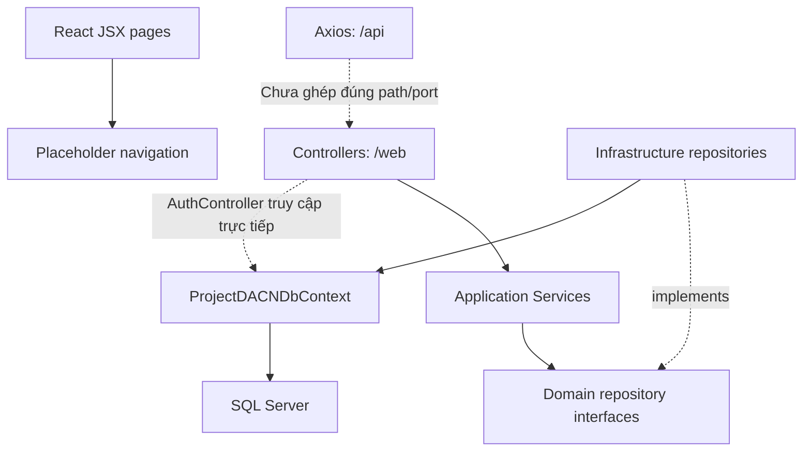

# Kiến trúc hiện tại và quy tắc phát triển

## FACT — compile-time dependencies

| Project thực tế | ProjectReference | Thành phần đã có |
|---|---|---|
| Project.Domain | Không có project reference | Entities, repository interfaces, IADO/ICrypt, cả implementation ADO/encryption |
| Project.Application | Domain | DTOs, Services, Interfaces/Services, AutoMapper, FluentValidation, JwtService |
| Project.Infrastructure | Domain | EF DbContext, configurations, repositories, seed, migrations |
| Project.Api | Application + Infrastructure | Controllers, auth/policy, middleware, composition root |

Cả bốn target net8.0. Đây là khung bốn lớp nhưng chưa hoàn toàn tách hạ tầng: Domain tham chiếu SqlClient/configuration và chứa implementation; AuthController dùng DbContext trực tiếp. Không gọi toàn bộ hiện trạng là Clean Architecture thuần.

## FACT — flow hiện tại

LoginPage/RegisterPage chưa gọi Axios. Room là lát cắt đi qua controller/service/repository, nhưng IADO constructor và DI registrations cần sửa trước khi kết luận chạy được.

## REQUIRED — tiến tới boundary rõ mà giữ codebase

Giữ tên Project.* và layout repo gốc; không tạo src/DACN.* song song. Domain giữ entity/invariant/interfaces hiện hữu; chuyển implementation SQL/encryption sang Infrastructure khi sửa boundary, không viết thêm I/O vào Domain. Repository interface hiện ở Domain không bắt buộc chuyển hàng loạt sang Application chỉ vì ví dụ tài liệu.

Application điều phối use case, validation, mapping và transaction. Infra implement persistence. API chỉ HTTP/auth/composition; tách dần logic auth khỏi controller sang use case nhưng giữ contract khi chưa có coordinated change. AutoMapper đã có, tiếp tục dùng đúng phạm vi và kiểm field nhạy cảm; manual mapping của feature hiện hữu có thể giữ.

Không có unit of work/use case submit nguyên tử đầy đủ trong snapshot mới; repository thường SaveChanges riêng. Luồng exam attempt phải thiết kế ranh giới giao dịch trước khi gọi nhiều repository.

## Kết nối mục tiêu gần nhất

Giữ `/web` là API prefix hiện tại. Dev FE dùng baseURL `/web` và Vite proxy `/web` về profile HTTPS `https://localhost:7242`; dev certificate phải được tin cậy. Proxy chỉ tắt kiểm certificate nếu giới hạn riêng môi trường local và được ghi rõ. Port 7242/5081 lấy từ launchSettings, có thể bị env override.

Production đề xuất cùng origin: SPA ở `/`, API ở `/web`. Nếu dùng cross-origin, phải bổ sung CORS allowlist vì Program.cs hiện chưa đăng ký/UseCors. Connection string lấy `ConnectionStrings:Default` (env `ConnectionStrings__Default`), không dùng DefaultConnection như ví dụ v0.1.

Module nghiệp vụ cần hoàn thiện: IdentityAccess, AcademicCatalog, QuestionBank, ExamDefinition, Scheduling, Attempts, ResultsReporting, Audit. Một backend + SQL Server là baseline; chưa có nhu cầu xác minh để thêm microservices/Redis.
