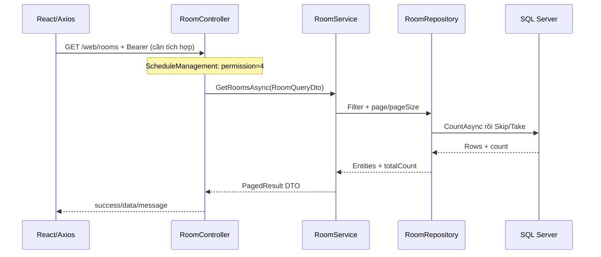

# Flow FE–BE–SQL theo code hiện tại và đích triển khai

## FACT — đăng nhập chưa nối end-to-end

LoginPage.handleSubmit chỉ navigate tới admin dashboard. Axios có withCredentials=true nhưng chưa có request interceptor Bearer/refresh. BE có POST /web/auth/login nhận keyword/password, trả ApiResponse chứa accessToken/refreshToken/userId/userName/email/levelId/permissionIds.

BE login gọi IUserRepository.GetByKeyAndPasswordAsync → BCrypt.Verify → lấy permission bằng DbContext → JwtService.GenerateToken → revoke refresh token cũ, thêm token mới, SaveChanges → JSON. Refresh nhận token trong body, không có Set-Cookie. IADO constructor cần sửa trước khi xác minh runtime login.

## REQUIRED — lát cắt tích hợp đầu tiên

1. Sửa blocker IADO và service DI, bảo vệ UserResponseDto/authorization trước dùng dữ liệu thật.
2. Đồng bộ FE baseURL `/web`, proxy `/web` về profile BE đang chạy. Giữ path auth/rooms đúng controller; không tự thêm `/api`.
3. Login gửi `{keyword: emailOrPhone, password}`; đọc `response.data.data`, chỉ điều hướng khi success và dữ liệu phiên hợp lệ.
4. API client attach Bearer và xử lý 401/403. Không dùng giá trị người dùng chọn ở SelectRolePage để cấp quyền.
5. GET /web/auth/me kiểm phiên; GET /web/rooms kiểm một flow có policy thật. Login success không tự đảm bảo có permission 4 để đọc rooms.
6. Sau khi contract login hiện tại hoạt động, chuyển refresh sang HttpOnly cookie + hash DB theo kế hoạch phối hợp FE/BE nếu áp dụng thiết kế hardening.

## FACT — CRUD Room

Đây là flow đọc source, chưa phải trace chạy thật. Repository thiếu OrderBy trước paging; cần sửa và giới hạn PageSize. App hiện không có trang quản lý Room.

## PROPOSED — tạo đề và thi

QuestionBank → Exam cấu hình → ExamDetail/mã đề → snapshot phiên bản → ExamSchedule/gán lớp → StartAttempt → SaveAnswers → Submit → Results/Reports. Chỉ phần entity/CRUD một số bước đã có; không coi chúng là engine hoàn chỉnh.

Backend phải quyết identity, eligibility, số lượt, lựa chọn mã đề, thứ tự, deadline, điểm và kết quả. FE chỉ gửi lựa chọn. Reload lấy lại state server. Submit và worker timeout dùng cùng finalize transaction/idempotency. Xem [exam engine](../01-backend/04-exam-engine.md) và [API sketch](../04-contracts/02-exam-api.md).

## PROPOSED — Excel và báo cáo

Testify có controller import/export và query báo cáo, nhưng BE mới chưa expose các use case tương đương. Parse/validate → transaction → báo lỗi từng dòng; báo cáo aggregate phía SQL theo chính sách lượt/hủy đã thống nhất. Không lấy số hardcode ở AdminDashboardPage làm thống kê thực.
