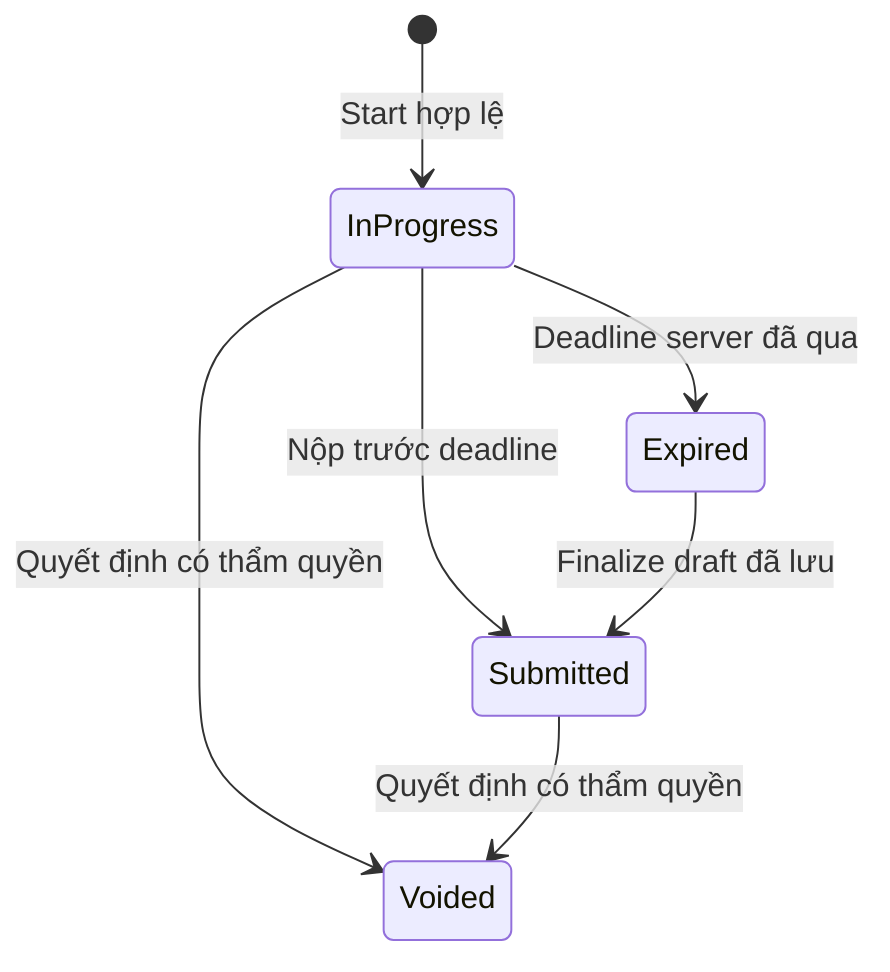

# BE — engine làm bài và chấm điểm

## FACT — BE mới chưa có engine này

Có DoingExam/Submission/AnswerSubmission entities và CRUD. SubmissionService nhận điểm, pass flag, user và giờ nộp từ DTO; chưa có StartAttempt/SaveDraft/Submit idempotent, snapshot hoặc worker finalize. Không được dùng CRUD hiện tại làm student submit. Thiết kế bên dưới là phần phải bổ sung theo parity và các quyết định nghiệp vụ còn OPEN.

PROPOSED. Tách khỏi ViewExamTest.razor.ScoreExam cũ. Chưa chốt các OPEN về chấm điểm thì không tuyên bố parity đã đạt.

## Mô hình trạng thái

Giữ FinalizedReason (Manual/Timeout) khi chuyển Submitted; Voided giữ nguyên lịch sử điểm và người/hành vi hủy. Không cho mở lại bằng CRUD status chung.

## StartAttempt

Trong transaction: kiểm identity, membership lịch/lớp, trạng thái đề/lịch, số lượt và active attempt. Baseline: một active attempt mỗi user/lịch; request start lặp trả attempt đang có. Chống race bằng unique constraint và serialize cập nhật bản ghi eligibility user/lịch hoặc khóa tương đương; không dùng Count rồi Insert ngoài transaction.

Chọn mã đề tại BE, chụp nội dung/đáp án/điểm/quy tắc chấm, lưu thứ tự câu và đáp án. Student response loại toàn bộ correct flags. Baseline deadline = min(serverStart + duration, scheduleEnd), cần duyệt O06. Chốt số lượt tính khi start hay finalize trước khi tạo constraint.

## Save draft

API nhận toàn bộ answerIds cho từng question trong attempt, kèm revision. Validate question thuộc snapshot và answer thuộc question đó; không tin question type/point từ client. Lưu một bản draft theo attempt/question, thay tập lựa chọn nguyên tử. Chỉ nhận trước deadline. Revision cũ trả 409 và bản revision hiện tại, không overwrite âm thầm.

Không cho payload duplicate question/answerIds làm tăng điểm. Một câu chưa chọn = tập rỗng; không tạo đáp án giả status 255 trong mô hình mới.

## Finalize

Khóa/đổi trạng thái attempt có concurrency control. Nếu đã finalized, trả lại kết quả được lưu. Lấy draft hoặc final answers đã được chấp nhận trước deadline; tuyệt đối không nhận đáp án mới sau deadline.

Tính điểm bằng snapshot và server logic. Lưu Submission + câu trả lời + final state + idempotency record trong một transaction. Unique Submission.AttemptId là hàng rào cuối. Worker finalize quá hạn và request submit cạnh tranh phải ra một kết quả duy nhất.

FE submit trước deadline được phép gửi final answers cùng request; backend validate và lưu trong transaction finalize. Với attempt quá hạn chỉ chấm draft đã lưu. Không chỉ đợi debounce ở React rồi giả định tất cả đã được server lưu.

## Chấm điểm baseline cần xác nhận

- TrueFalse và SingleChoice: đúng khi chọn đúng một đáp án và đó là đáp án đúng.
- MultipleChoice: điểm trọn câu khi tập chọn bằng chính xác tập đúng; thiếu/thừa đều 0. Không rẽ nhánh theo số đáp án người dùng chọn như code cũ.
- FillAnswer=4 chỉ thấy enum; chưa đủ bằng chứng cơ chế normalize/chấm. Không tự triển khai hoặc tuyên bố đã có.
- Dùng decimal cho điểm, precision cố định ở SQL; cộng điểm chưa làm tròn, làm tròn tổng một lần. Baseline đề xuất 2 chữ số, MidpointRounding.AwayFromZero; phải duyệt vì có thể khác Math.Round(double,2) cũ.
- IsPassed được tính từ điểm theo quy tắc đã duyệt, không nhận từ FE. Chốt so sánh trước/sau làm tròn; baseline so sánh tổng chưa làm tròn với PassMark.

## Kịch bản bắt buộc

Hai request start đồng thời; submit double click; worker và submit cùng lúc; mạng mất sau commit; save đến trễ; reload; đổi giờ máy; giả UserId/điểm; câu nhiều đáp án chọn một đúng; câu đã sửa ở ngân hàng sau start; user bị thu hồi quyền giữa phiên. Chính sách thu hồi phiên đang thi cần ghi rõ trước release.

Tab visibility chỉ là audit signal, không bằng chứng gian lận tuyệt đối; không tự động đánh trượt khi rời tab nếu chưa có yêu cầu.
