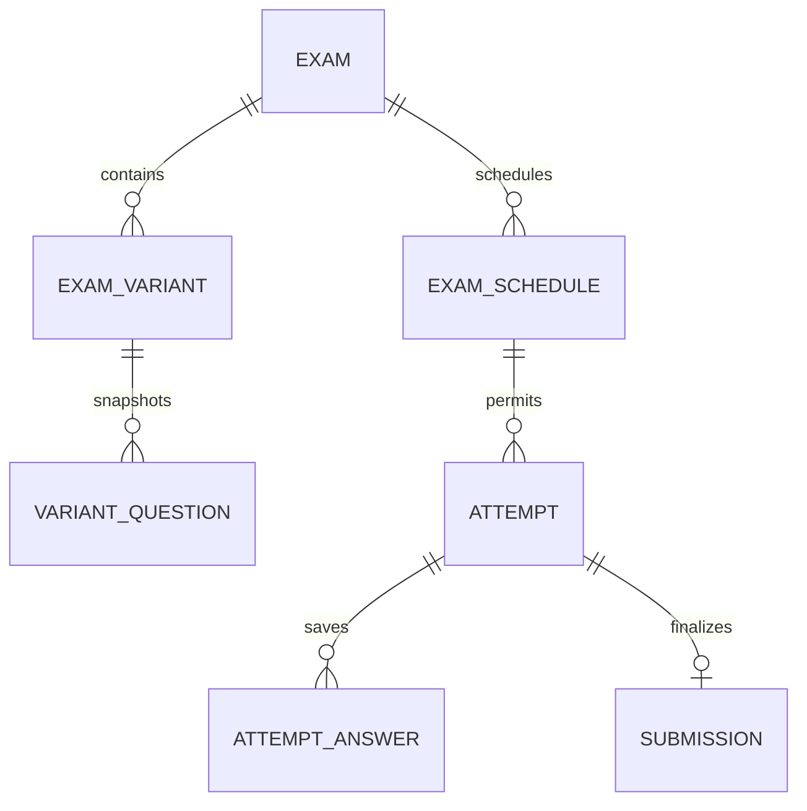

# DATABASE — mô hình và quan hệ

## FACT — database model của BE mới

ProjectDACNDbContext ở Project.Infrastructure/Persistence, ApplyConfigurationsFromAssembly và seed classes. DI UseSqlServer đọc ConnectionStrings:Default. Migration 20260628110050_2806_updaetmơi11 tạo 25 bảng theo source; không chứng minh đã apply lên DB thực tế. Không có Redis/procedure migration được thấy.

Schema dùng SQL float cho điểm, datetime2 cho nhiều instant/date và time cho Submission.TimeTaken (TimeOnly). Có unique Email/PhoneNumber/UserName, ClassCode và index FK; chưa có attempt/snapshot/idempotency/rowversion design đề xuất.

Quan hệ hiện tại map Exams.ExamScheduleId sang ExamSchedules; ExamSchedules.ExamId cũng tồn tại nhưng không được map như FK mục tiêu Exam→many schedules. Phải sửa configuration + migration sau khi chốt dữ liệu, không chỉ sửa navigation. Hai DbSet ClassExamSchedule trùng tên là phát hiện Testify cũ, không phải DbContext mới.

Các nhóm legacy và mô hình mục tiêu dưới đây vẫn giữ để hướng dẫn parity; đừng coi model đề xuất là schema đang chạy.

FACT: snapshot dùng EF Core SQL Server, model annotations, OnModelCreating và migrations. Không biết phiên bản engine SQL Server thực tế. Code First tạo/quản lý schema qua migration; kết nối thực hiện bằng provider UseSqlServer và cấu hình connection string.

## Nhóm entity cũ

| Nhóm | Tên source |
|---|---|
| Identity | User, Level, Permission, UserPermission, RefreshToken |
| Học vụ | Subject, Class, ClassUser, Room |
| Ngân hàng | Question, Answer, QuestionType, QuestionLevel, QuestionAnswer |
| Đề | Exam, ExamDetail, ExamDetailQuestion, ScoreMethod |
| Lịch | ExamSchedule, ClassExamSchedule |
| Thi và kết quả | DoingExam, Submission, AnswerSubmission, ExamActivityLog |
| Khác | UserLog.cs chứa LogEntity; Organization, OrganizationUser, BlackListToken có khai báo nhưng phải kiểm tra sử dụng |

ClassExamSchedule xuất hiện qua hai DbSet tên UserExamSchedules và ClassExamSchedules trong context cũ. Không coi hai DbSet là hai nghiệp vụ/bảng độc lập. ExamSchedule có ExamId nhưng navigation ICollection<Exam>; phải kiểm tra snapshot/migration trước mapping dữ liệu, không bê nguyên quan hệ này.

## Quan hệ mục tiêu cốt lõi

Diagram là tập con logic đề xuất, không phải ERD vật lý đầy đủ. User/Class/membership/permission nằm ngoài diagram. ExamVariant là tên khái niệm của ExamDetail; không tự rename bảng khi chưa chốt migration.

## Bổ sung mục tiêu

ExamAttempt: Id, UserId, ExamScheduleId, ExamVariantVersionId, AttemptNumber, StartedAt, ExpiresAt, State, FinalizedReason, Revision/RowVersion. AttemptAnswer: AttemptId, snapshotQuestionId, selectedAnswerIds theo mô hình normalized/child rows; không lưu đáp án đúng vào draft client.

ExamVariantVersion và snapshot câu/đáp án/điểm/quy tắc đảm bảo lịch sử bất biến. Nếu chọn snapshot riêng từng attempt thay version dùng chung, ghi ADR về dung lượng và tính bất biến. Một request không được trộn snapshot cũ với Answer mới.

Submission: một kết quả cho một attempt; decimal điểm, server timestamps, trạng thái hủy và audit. IdempotencyRecord: user, operation, key, requestHash, resource/result reference và expiry theo policy; không lưu raw credentials.

## Kiểu và ràng buộc

User GUID và nhiều entity int trong source cũ: giữ mapping rõ nếu đổi. Điểm mới dùng decimal(9,2) cho giá trị lưu cuối theo đề xuất; điểm trung gian có scale đủ cho quy tắc chấm đã chọn. Instant dùng datetimeoffset, date-only dùng date. String có max length, Unicode cho tiếng Việt; null khác empty.

FK explicit, check constraint điểm/thời gian hợp lý, unique constraints nghiệp vụ. Restrict xóa dữ liệu tham chiếu bởi kết quả; deactivate/archive nếu đã sử dụng. Không cascade xóa lịch sử thi khi xóa môn hoặc user. Quyền xóa dữ liệu cá nhân và retention cần policy riêng.
